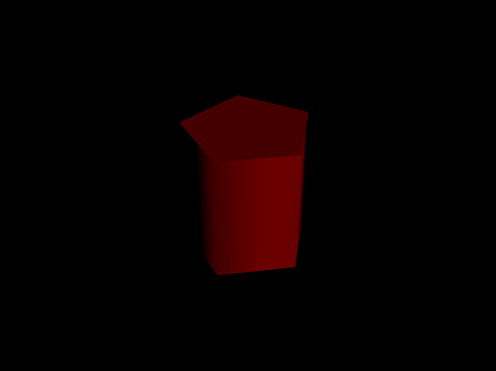
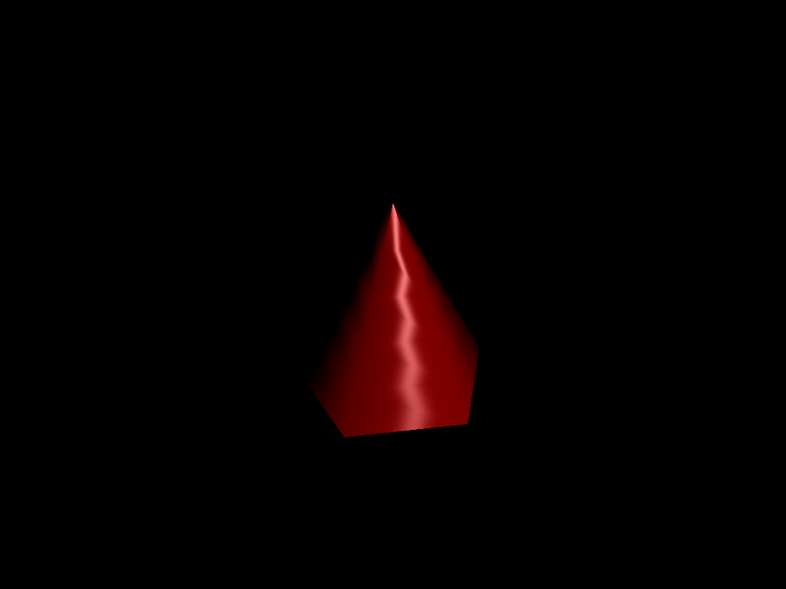
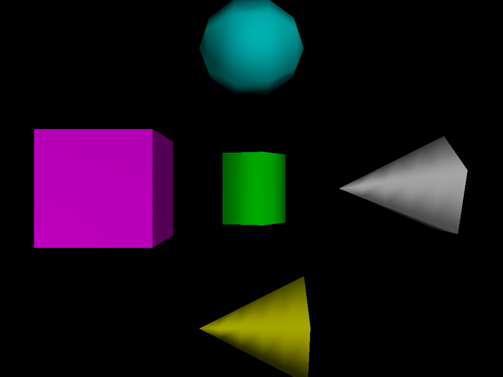
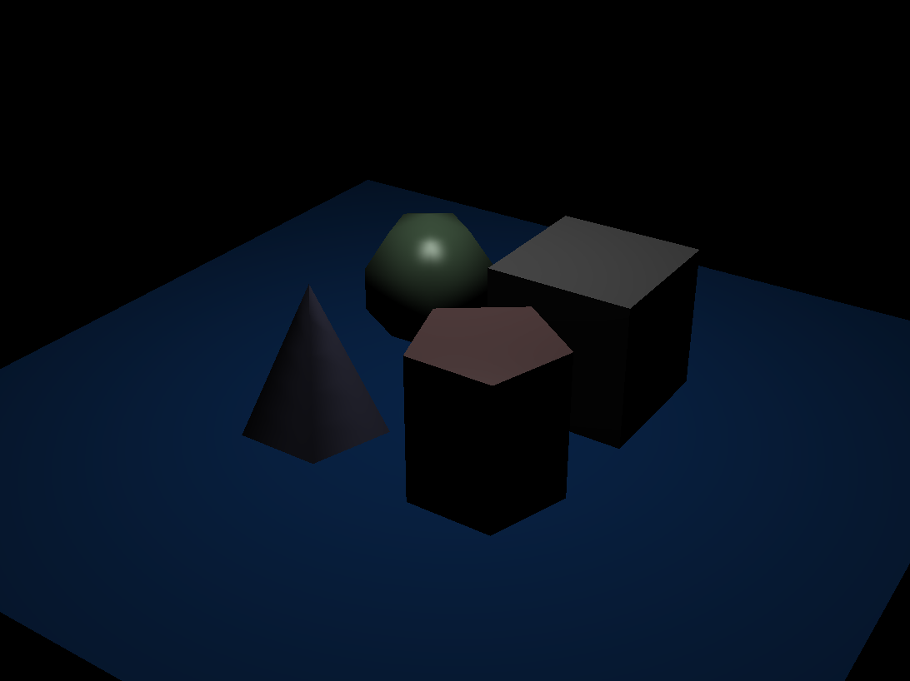
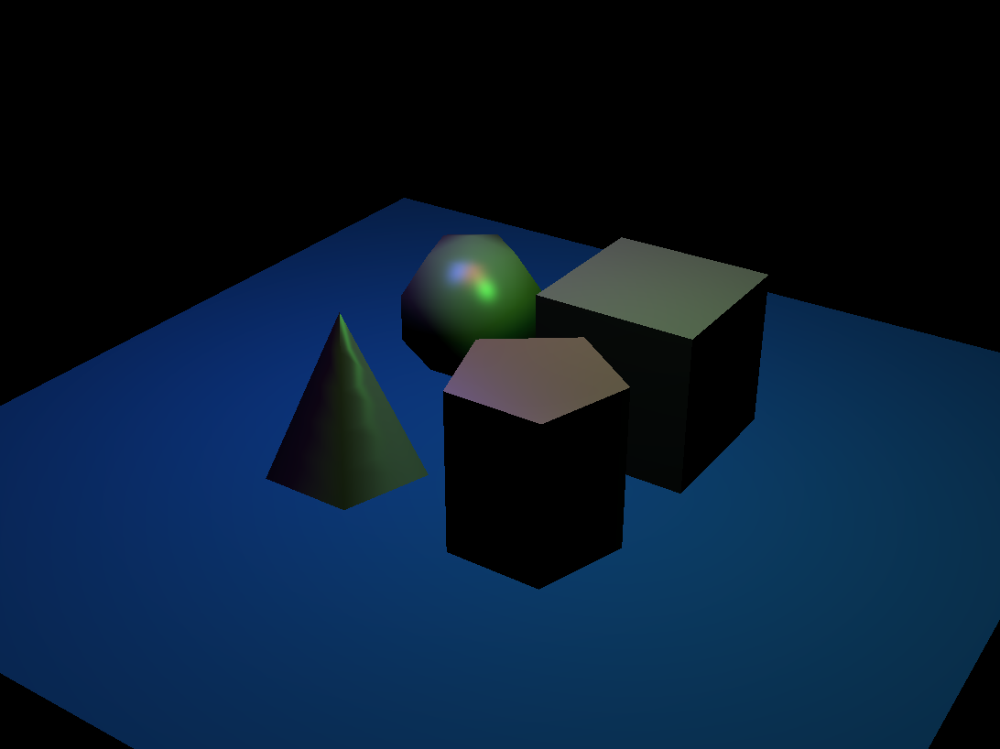
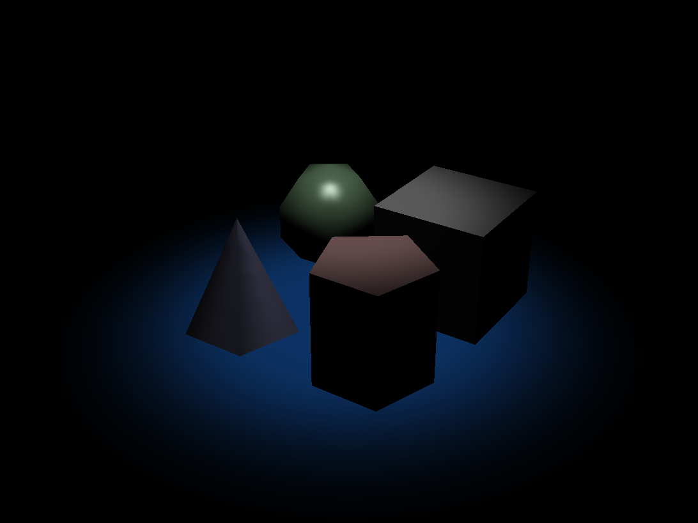
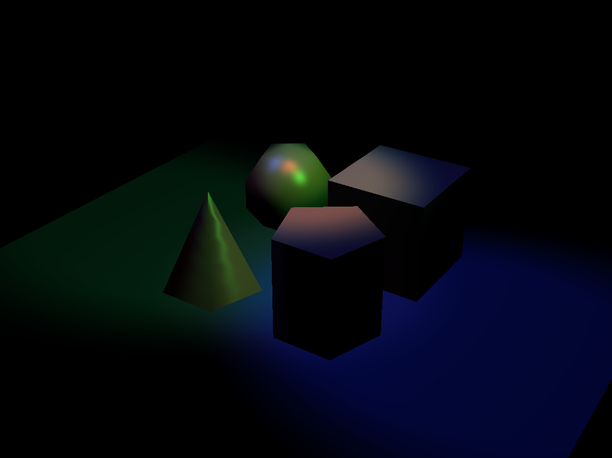

CSCI 1230 Realtime Renderer

This project is a realtime OpenGL renderer built for a computer graphics class at Brown. It uses Qt for the application framework, GLEW for OpenGL extensions, and GLM for math. The renderer supports scene parsing, camera controls, geometry generation, BRDF shading components, and post-processing.

Features
- **Scene parsing:** Loads scene files from `scenefiles/realtime` with cameras, primitives, transforms, and lights.
- **Procedural geometry:** Generates `unit_cube`, `unit_sphere`, `unit_cylinder`, and `unit_cone` meshes.
- **Lighting models:** Ambient, diffuse, and specular components; point, directional, and spot lights.
- **Post-processing:** Configurable effects via `resources/shaders` and `src/postprocess.*`.
- **Interactive controls:** Orbit/zoom/pan camera, toggle settings in the Qt UI.

Repo Structure
- `src/`: Application, renderer, settings, and post-processing code.
- `src/shapes/`: Procedural mesh generation for core primitives.
- `src/shaders/`: Runtime GLSL programs used by the renderer.
- `resources/shaders/`: Additional shader resources packaged with the app.
- `scenefiles/`: Sample scenes for testing parsing, lighting, and geometry.
- `student_outputs/realtime/required/`: Reference images of expected outputs.
- `glew/`, `glm/`: Third-party libraries included in-tree.

Build & Run (macOS)
Requirements: Qt 6, CMake, a C++17 compiler.

```
# From the project root
cmake -S . -B build
cmake --build build --config Release

# If an app target is generated, you can run it via
open build/projects_realtime/projects_realtime.app
```

Notes:
- The build layout may differ depending on your Qt/CMake toolchain. In some setups, the app appears under `build/*/projects_realtime.app`.
- If Qt is not found, ensure `Qt6_DIR` points to your Qt 6 installation or configure via Qt Creator.

Usage
- Launch the app and open a scene from `scenefiles/realtime` or other scenario folders.
- Use the settings panel (see `src/settings.*`) to toggle shading terms and post-processing.
- Camera controls are provided in `src/camera` and wired to mouse/keyboard input.

Example Outputs
Below are example images from `student_outputs/realtime/required` that illustrate geometry generation and lighting components.

## Geometry






## Lighting Components





## Lights










Development Notes
- Core entry points: `src/main.cpp`, `src/realtime.*`, `src/mainwindow.*`.
- Post-processing shaders can be adjusted in `resources/shaders` and `src/postprocess.*`.
- Mesh generation lives under `src/shapes` and math utilities under `glm`.

Troubleshooting
- Qt not found: install Qt 6 (e.g., via Qt Online Installer) and set `Qt6_DIR` or use Qt Creator with a Qt 6 kit.
- Linker errors for GLEW: ensure `glew` submodule/library is built and linked; see `glew/README.md`.
- GLSL compile errors: check shader versions and defines in `resources/shaders` and GPU support.

License
Course scaffolding and third-party libraries retain their original licenses. Student implementations are for educational use.


