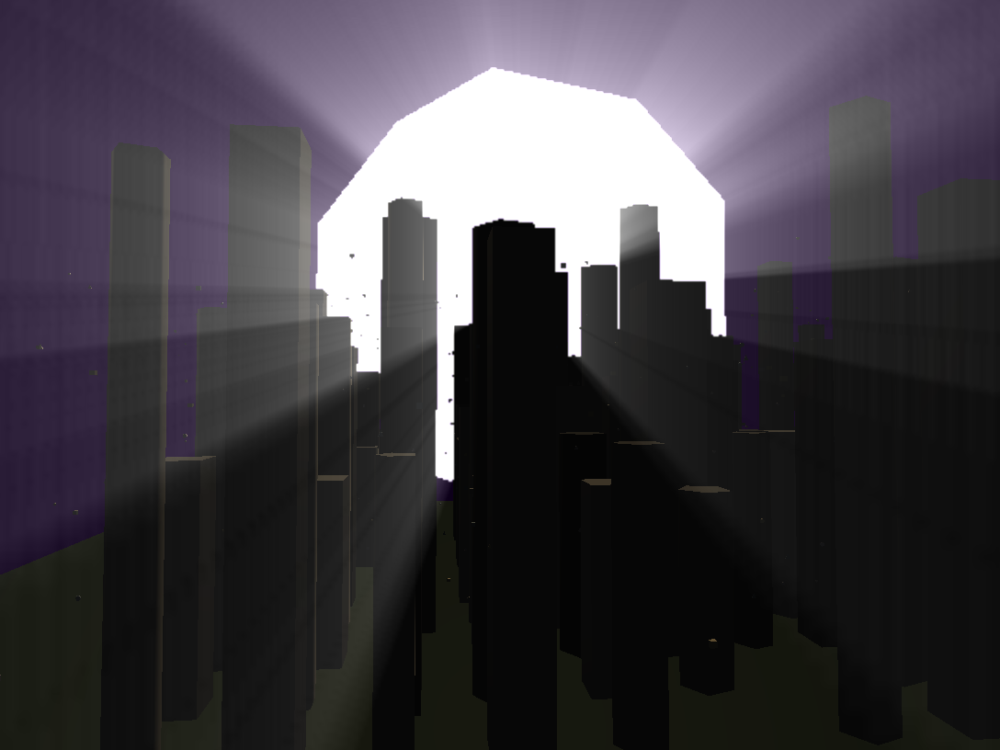
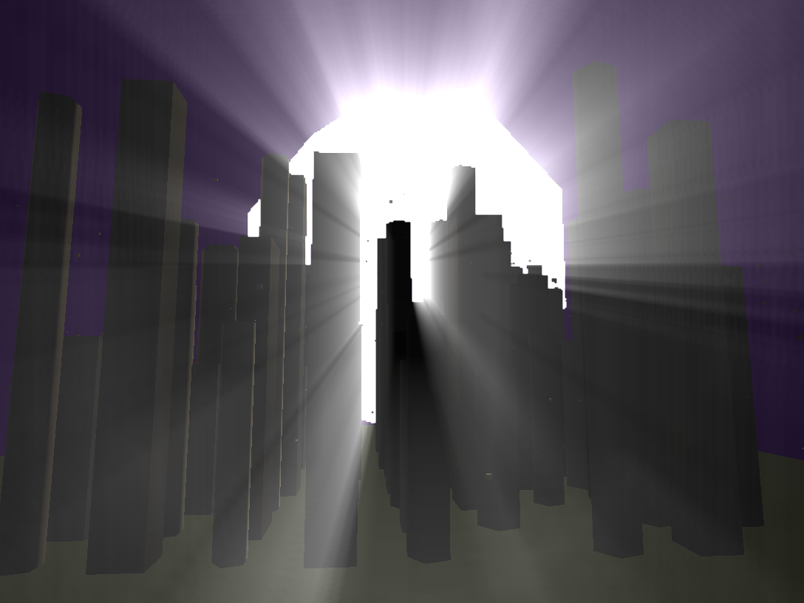
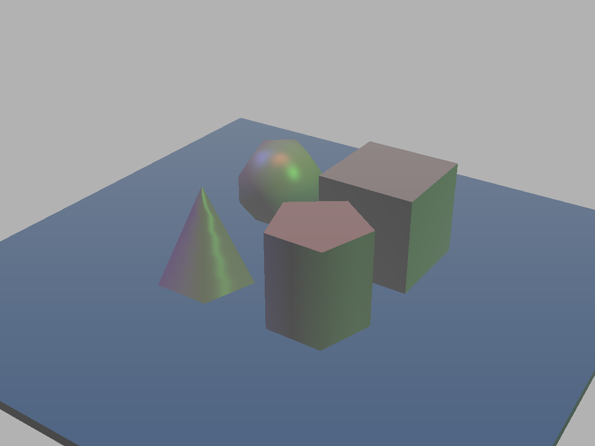
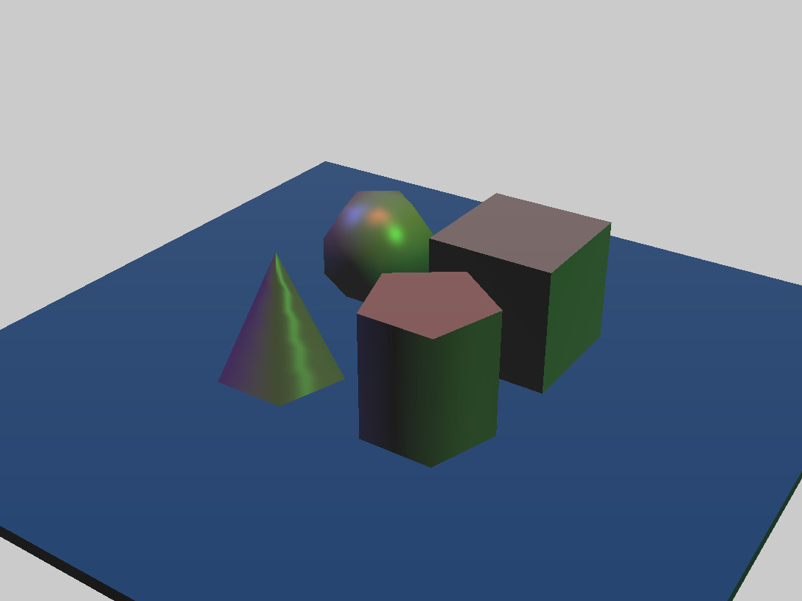
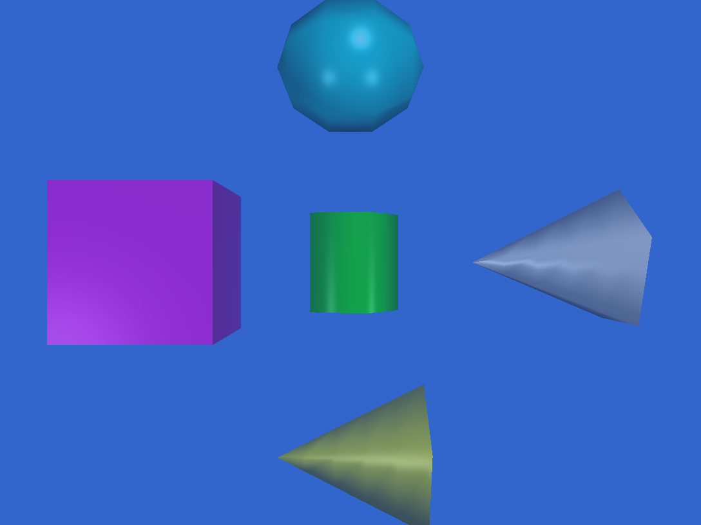
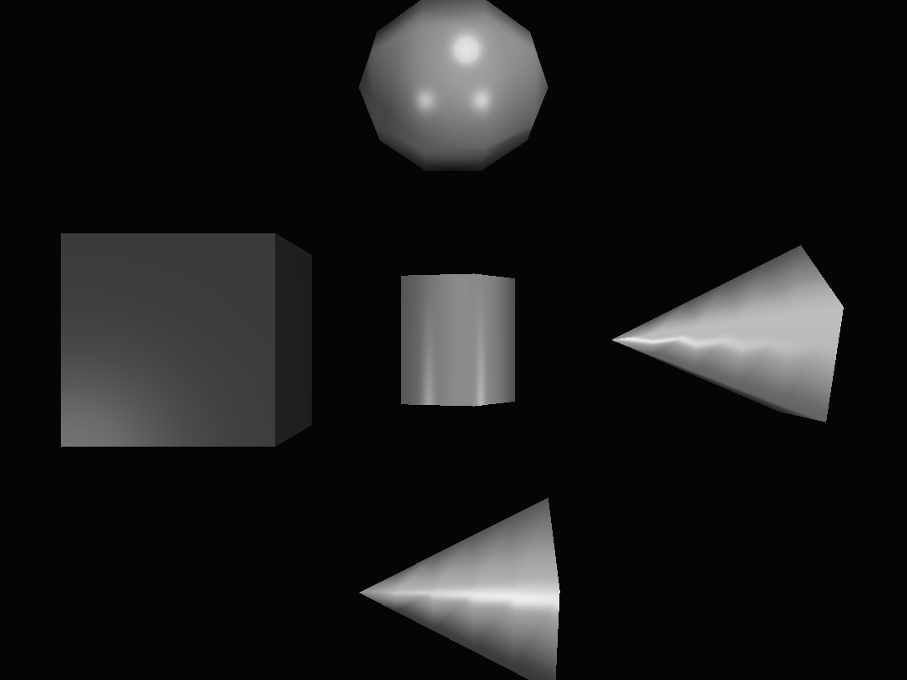
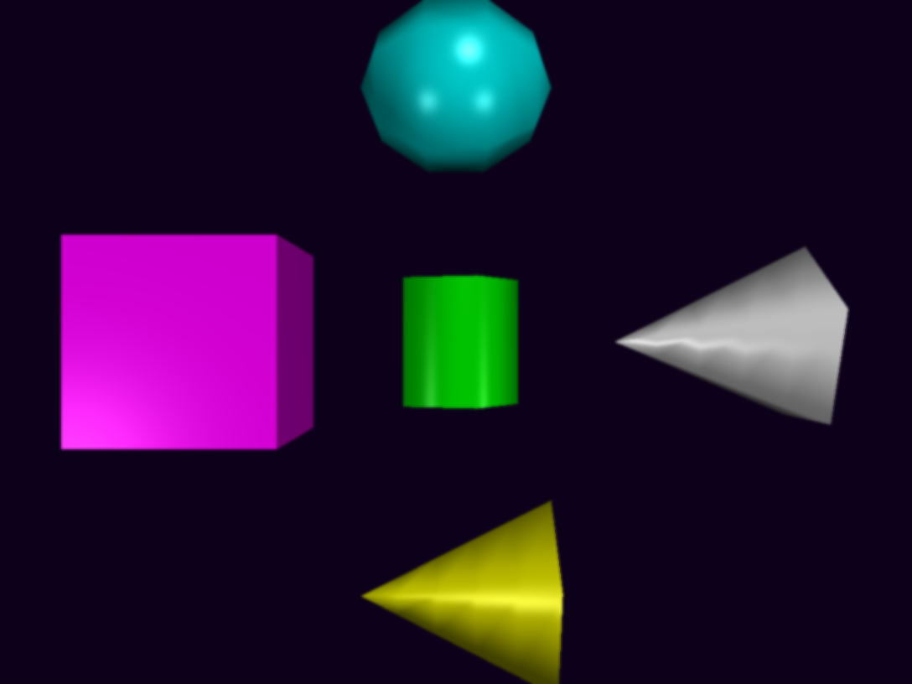
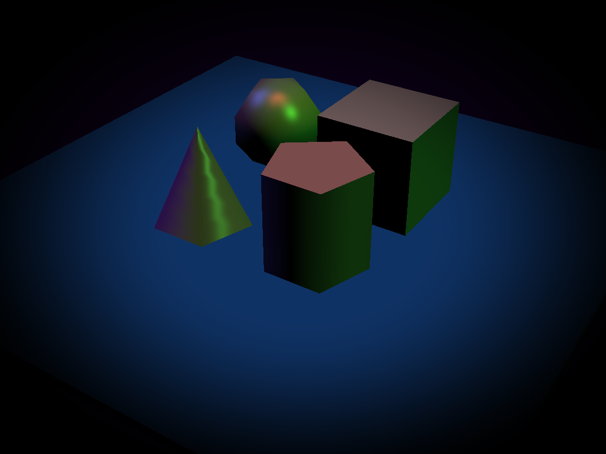

## Project 6: Extra Credit Features

This submission showcases additional features implemented beyond the base project requirements.

### Feature Test Cases

For each test case, load the specified scene file, adjust parameters as indicated, and save the output image with the specified filename.

#### God Rays (Screen-Space Volumetric Lighting)

|                                           Test Case                                            |                                                                     Your Output                                                                     |
| :----------------------------------------------------------------------------------------------------------------: | :-------------------------------------------------------------------------------------------------------------------------------------------------: |
| **Test 1: Basic God Rays** Input: `chess.json` Output: `godrays_basic.png` Parameters: (5, 5, 0.1, 100) **God Rays Settings:** Enable god rays, samples=100, decay=0.98, weight=0.5, density=0.6, exposure=1.0 |  |
| **Test 2: Strong God Rays** Input: `chess.json` Output: `godrays_strong.png` Parameters: (5, 5, 0.1, 100) **God Rays Settings:** Enable god rays, samples=150, decay=0.96, weight=0.8, density=0.8, exposure=1.2 |  |
| **Test 3: Subtle God Rays** Input: `chess.json` Output: `godrays_subtle.png` Parameters: (5, 5, 0.1, 100) **God Rays Settings:** Enable god rays, samples=80, decay=0.99, weight=0.3, density=0.5, exposure=0.8 |  |

#### Fog Effect

|                                           Test Case                                            |                                                                     Your Output                                                                     |
| :----------------------------------------------------------------------------------------------------------------: | :-------------------------------------------------------------------------------------------------------------------------------------------------: |
| **Test 1: Dense Fog** Input: `chess.json` Output: `fog_dense.png` Parameters: (5, 5, 0.1, 100) **Fog Settings:** Enable fog, density=0.08, fog color=(0.7, 0.7, 0.7) gray |  |
| **Test 2: Light Fog** Input: `chess.json` Output: `fog_light.png` Parameters: (5, 5, 0.1, 100) **Fog Settings:** Enable fog, density=0.02, fog color=(0.8, 0.8, 0.8) light gray |  |
| **Test 3: Colored Fog** Input: `chess.json` Output: `fog_colored.png` Parameters: (5, 5, 0.1, 100) **Fog Settings:** Enable fog, density=0.05, fog color=(0.2, 0.4, 0.8) blue tint |  |

#### Post-Processing Effects

|                                           Test Case                                            |                                                                     Your Output                                                                     |
| :----------------------------------------------------------------------------------------------------------------: | :-------------------------------------------------------------------------------------------------------------------------------------------------: |
| **Test 1: Grayscale** Input: `phong_total.json` Output: `postprocess_grayscale.png` Parameters: (5, 5, 0.1, 100) **Effect Settings:** Enable grayscale only (disable blur and vignette) |  |
| **Test 2: Blur Effect** Input: `phong_total.json` Output: `postprocess_blur.png` Parameters: (5, 5, 0.1, 100) **Effect Settings:** Enable blur only, blur radius=2.5 (disable grayscale and vignette) |  |
| **Test 3: Vignette Effect** Input: `phong_total.json` Output: `postprocess_vignette.png` Parameters: (5, 5, 0.1, 100) **Effect Settings:** Enable vignette only, strength=0.6, extent=0.6 (disable blur and grayscale) |  |

### Design Choices

I chose to make a camera class that handles camera rotation, translation, and projection/view matrix calculations.

Within realtime, I made a struct called ShapeGeometry that holds each shape's VAO and VBO values, and updates when the settings change.

For instanced rendering, I implemented batching by shape type to reduce draw calls and improve performance for scenes with many objects.

#### Extra Credit Features

**God Rays (Screen-Space Volumetric Lighting):**
- Implemented using radial blur from light position in screen space
- Occlusion pass renders scene to determine light visibility
- Configurable parameters: samples (quality), decay, weight (intensity), density, exposure
- Creates atmospheric volumetric lighting effect

**Fog Effect:**
- Depth-based fog using exponential falloff
- Configurable fog density and color
- Applied in screen space after scene rendering
- Creates atmospheric depth perception

**Post-Processing Effects:**
- Modular post-processing framework for easy effect addition
- Grayscale: Luminance-based black and white conversion
- Blur: 5x5 Gaussian kernel blur with configurable radius
- Vignette: Distance-based edge darkening with configurable strength and extent
- Effects can be chained together and enabled/disabled independently

**Performance Comparison:**
- Implemented both instanced and non-instanced rendering paths
- Toggle available via `m_use_instanced_rendering` flag
- Instanced rendering provides significant performance improvement for scenes with many objects

### Collaboration/References

I worked alone for this project, but used labs and code from raytracing as they applied to the project.

For the extra credit features, I referenced:
- GPU Gems 3 for god rays implementation concepts
- OpenGL post-processing tutorials for framebuffer techniques
- Graphics programming resources for fog and atmospheric effects

### Known Bugs

There are no bugs that I know of.

### Extra Credit
